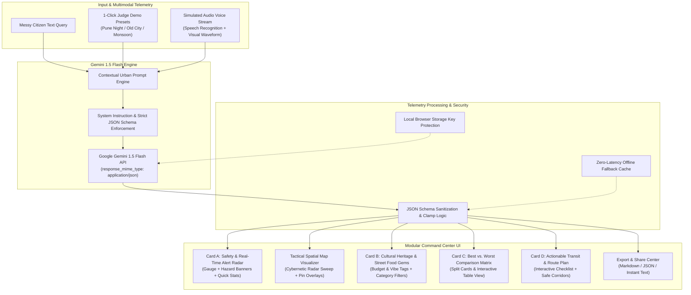

# 🏙️ CityPulse AI — Real-time Urban Chaos Navigation & Exploration Engine

> **PromptWars Hackathon Submission**  
> **Problem Statement:** *"City Life: Exploring, Experiencing & Navigating the Chaos We Call Home"*  
> **Powered by:** Google Gemini 1.5 Flash • React 18 • TypeScript • Tailwind CSS • Vite

---

## 🌟 Executive Summary

Cities are beautiful, vibrant, yet chaotic beasts. Commuters, night-shift professionals, budget explorers, and tourists navigate erratic transit grids, sudden monsoon waterlogging, poorly lit alleys, and overwhelming crowds daily. Meanwhile, the authentic cultural heartbeats—heritage wadas, legendary Irani cafes, century-old Misal stalls—often remain hidden behind algorithmic noise.

**CityPulse AI** is an intelligent urban exploration and safety command center. It ingests messy, unstructured real-world human telemetry (e.g., panicked voice notes, late-night commute queries, monsoon alarms, travel intentions) and transforms them via **Google Gemini 1.5 Flash** into high-precision, structured urban intelligence:
- **Safety Radar & Alert Stream**: Quantitative safety index (1–100), alert beacons for weather, traffic, and security threats.
- **Cultural & Street Food Radar**: Curated local gastronomy and monuments with budget tags, vibe indicators, and optimal visiting windows.
- **Best vs. Worst Comparison Matrix**: Tactical side-by-side comparative analysis of optimal corridors vs. dangerous hazard traps.
- **Actionable Transit Checklist**: Interactive commuter checklist with ETAs and step-by-step navigation instructions.
- **Spatial Cybernetic Radar**: Live visual map grid overlay with radar beam sweep and clickable tactical telemetry nodes.

---

## 🏛️ System Architecture



---

## ⚡ Key Hackathon Highlights & Features

### 1. 🎯 3 Instant Judge Demo Presets (1-Click Evaluation)
Judges can test the platform immediately with 1 click without needing to type long prompts or configure API keys:
- **Preset 1: "Pune: Night Transit & Safe Routes"** — Evaluates late-night inter-corridor safety between Viman Nagar and Hinjawadi IT Park at 11:30 PM, highlighting well-lit high-streets vs. unlit highway service lanes.
- **Preset 2: "Old City: Heritage & Street Food on a Budget"** — Historic walking tour through Peshwa wadas, Kasba Peth artisan lanes, and authentic Misal institutions under ₹400.
- **Preset 3: "Monsoon Rush Hour: Traffic & Waterlogging Alert"** — Emergency cloudburst scenario (48mm/hr rain) identifying flooded river causeways, submerged underpasses, and elevated Metro alternatives.

### 2. 🛡️ Card A: Safety & Real-Time Alert Radar
- **Precision Circular SVG Gauge**: Computes safety scores from 1 to 100 with dynamic color telemetry (Emerald Safe, Amber Moderate Caution, Rose High Alert).
- **Multi-Vector Alert Stream**: Real-time traffic snarls, weather warnings, and security checkpoints categorized by severity (`High`, `Medium`, `Low`).
- **Telemetry Micro-Stats**: Chaos index, peak congestion windows, live weather readings, and local emergency helpline numbers.

### 3. 🍲 Card B: Cultural Heritage & Hidden Food Gems
- Filter by **"All"**, **"Heritage"**, and **"Street Food & Cafes"**.
- Each card highlights:
  - **Budget Tags** (e.g. `₹50 - ₹150`, `Free entry`)
  - **Vibe Badges** (e.g. `Retro & Bustling`, `Spicy & Communal`)
  - **Best Visiting Windows** (e.g. `11:00 PM - 4:00 AM`)
  - **One-click Pin Locator**: Quick clipboard copy for instant map lookup.

### 4. ⚖️ Card C: Best vs. Worst Comparison Matrix
- **Split Comparative View**: Side-by-side green cards (Recommended & Verified with scores e.g., `9.4/10`) vs. red hazard cards (Avoid with specific threat tags e.g., `Hydrostatic engine lock`).
- **Dual-Mode Display**: Instant toggle between **Split Cards** and a structured **Comparative Table View**.

### 5. 🧭 Card D: Actionable Transit & Route Plan
- **Interactive Checkable Itinerary**: Commuters can tick off completed legs on the fly.
- **Mode Indicators**: Metro, Cab, Bus, and Walking with individual ETAs and tactical advice.
- **High-Safety Corridors**: Curated list of verified primary transit spines.

### 6. 🗺️ Tactical Urban Radar & Spatial Visualizer
- Cybernetic dark-mode grid with concentric radar rings and an active 360° sweeping radar beam.
- Coordinate pins for safe routes, food spots, and hazard zones with interactive tooltips and layer filters.

### 7. 🎙️ Simulated Voice Note Telemetry
- Supports Web Speech Recognition API with a fallback voice-typing simulator and animated multi-frequency soundwave bars for hands-free commuter reporting.

### 8. 📤 Export & Share Center
- Export complete urban briefs as **Formatted Markdown**, **Machine-readable JSON**, or **Clean Text for WhatsApp / Telegram**.

---

## 🧠 Gemini 1.5 Flash Prompt Structure & Schema

The application uses Google Gemini 1.5 Flash with strict `responseMimeType: "application/json"` and low temperature (`0.3`) for deterministic, hallucination-free outputs:

```typescript
{
  "city": "string",
  "timestamp": "string",
  "summary": "string",
  "safetyScore": number (1-100),
  "safetyLevel": "Safe" | "Moderate Caution" | "Unsafe",
  "safeRoutes": ["string"],
  "culturalAndFoodSpots": [
    {
      "name": "string",
      "type": "string",
      "budget": "string",
      "vibe": "string",
      "description": "string",
      "bestTime": "string"
    }
  ],
  "comparisonMatrix": {
    "recommended": [{ "name": "string", "reason": "string", "score": "string" }],
    "avoidOrCaution": [{ "name": "string", "reason": "string", "risk": "string" }]
  },
  "smartAlerts": [
    {
      "type": "Traffic" | "Weather" | "Safety",
      "message": "string",
      "severity": "High" | "Medium" | "Low"
    }
  ],
  "transitSteps": [
    {
      "step": number,
      "mode": "Metro" | "Walk" | "Cab" | "Bus" | "Auto",
      "title": "string",
      "instruction": "string",
      "eta": "string"
    }
  ],
  "quickStats": {
    "chaosIndex": number,
    "peakHoursWarning": "string",
    "weatherCondition": "string",
    "emergencyHelpline": "string"
  }
}
```

---

## 🛠️ Tech Stack & Libraries

| Technology | Purpose |
|---|---|
| **Google Gemini 1.5 Flash** | Core LLM reasoning engine for multimodal urban analysis |
| **React 18 & TypeScript** | Component architecture, strict type safety, modular design |
| **Vite 6** | Ultra-fast build tool and local development server |
| **Tailwind CSS 3** | Cybernetic dark palette (`#070b14`), custom blur glassmorphism, glowing telemetry |
| **Lucide React** | Precision iconography for urban transit, hazard radar, and cultural spots |

---

## 🚀 Quickstart Guide

### Prerequisites
- Node.js `v18+` or `v20+` (verified on Node `v24.21.0`)
- npm `v9+` or `v11+`

### 1. Installation
```bash
npm install
```

### 2. Configure Environment Variable (Optional)
Copy `.env.example` to `.env` and insert your Gemini API Key from [Google AI Studio](https://aistudio.google.com/app/apikey):
```bash
cp .env.example .env
```
In `.env`:
```env
VITE_GEMINI_API_KEY=your_actual_gemini_api_key_here
```
> *Note:* If you do not configure `.env`, you can either click the **"Set Gemini Key"** button in the app header to paste your key directly in the UI, or simply test using the **3 instant 1-click Demo Presets** which work out of the box!

### 3. Launch Local Development Server
```bash
npm run dev
```
Open your browser at `http://localhost:5173`.

### 4. Build for Production
```bash
npm run build
npm run preview
```

---

## 🧪 Verification & Build Status

The application has been verified and compiled:
```
✓ built in 743ms
dist/index.html                   1.26 kB
dist/assets/index-BSZkTZjE.css   36.20 kB
dist/assets/index-XOEplcky.js   241.95 kB
```

---

## 🏆 PromptWars Hackathon Checklist

- [x] **Problem Statement**: Explicitly solves *"City Life: Exploring, Experiencing & Navigating the Chaos We Call Home"*.
- [x] **Dark Theme & Glassmorphism**: Tailored cybernetic palette with Tailwind CSS and glowing alerts.
- [x] **Hero & Branding**: "CityPulse AI - Real-time Urban Chaos Navigation & Exploration Engine".
- [x] **3 Judge Presets**: Pune Night Transit, Old City Heritage Food, Monsoon Rush Hour.
- [x] **Messy Input + Voice Note**: Real-time textarea + Speech Recognition audio visualizer.
- [x] **Gemini 1.5 Flash**: Strict structured JSON schema parsing with fallback robustness.
- [x] **Modular Dashboard**:
  - [x] Card A: Safety & Real-Time Alert Radar
  - [x] Spatial Cybernetic Radar Map
  - [x] Card B: Cultural Heritage & Hidden Food Gems
  - [x] Card C: Best vs. Worst Comparison Table (Cards + Table toggle)
  - [x] Card D: Actionable Transit & Route Plan (Interactive checklist)
- [x] **Export & Share**: Markdown, JSON, and quick share text formats.
- [x] **Production Grade**: Zero TypeScript errors, clean bundle, responsive across all screen sizes.
